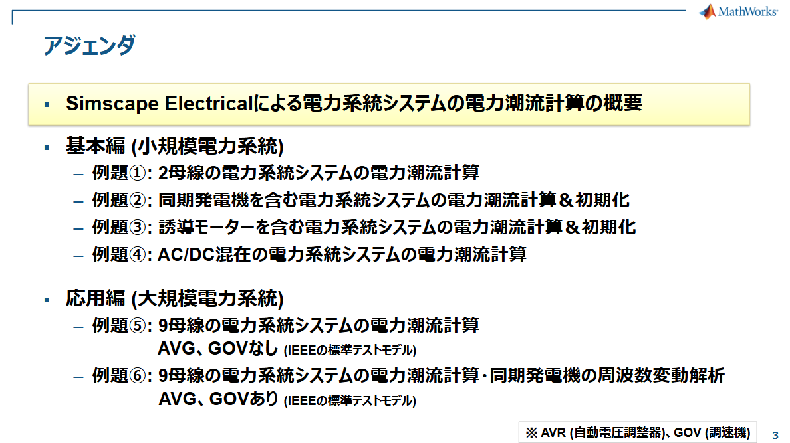

# 1. MATLAB/Simulinkを用いて潮流解析を扱うサンプル
---
## 1-1. Simscape Electricalを用いた潮流解析・周波数変動解析

Simscape Electricalを使用して、小規模な2母線システムからIEEE 9母線システムまで、
電力潮流 (定常)や、同期発電機の周波数変動 (過渡) を解析できます。

Simscape Electricalによる電力系統システムの電力潮流計算の手順と、
各例題に対応するサンプルモデルへのリンクを以下の資料にまとめています：

### **[SimscapeElectricalによる電力系統システムの電力潮流計算](https://content.mathworks.com/viewer/f355e38faac181773aeaf358d0228b24)**

https://content.mathworks.com/viewer/f355e38faac181773aeaf358d0228b24

サンプルを起点にすることで、学習・検証・実装までスムーズに進められます。

また、R2026aからリリースした[Simulink Copilot](https://jp.mathworks.com/products/simulink-copilot.html)をお使いいただくと、AIにモデルの中身を解説させたり、アドバイスを求めたりすることが可能です。

---
## 1-2. MATPOWERを用いた潮流解析

MATPOWER は、MATLAB上で動作する電力系統解析用オープンソースツールボックスです。

公式サイト: [https://matpower.org/](https://matpower.org/)

MATPOWERによる潮流計算結果を可視化するMATLABスクリプト：

https://github.com/shin-keitou/MATPOWER-and-Simscape-Electrical/blob/main/plot_power_flow_case9.mlx

※ スクリプトを実行するには、MATPOWERのインストールが必要です。

---
# 2. MATLAB/Simulink Agentic Toolkit

MATLAB/Simulink Agentic Toolkit は、Claude Code、GitHub Copilot、OpenAI Codex、Gemini CLI、Sourcegraph Amp などの AI エージェントが MATLAB や Simulink を活用して開発を行うためのツール群と専門知識を提供します。

上記で紹介した Simscape Electrical のモデルも、AI を使って構築可能です。

- **[Simulink Agentic Toolkit](https://jp.mathworks.com/products/simulink-agentic-toolkit.html)**

- **[MATLAB Agentic Toolkit](https://jp.mathworks.com/products/matlab-agentic-toolkit.html)**

セットアップは、各GitHub リポジトリの「Get Started」に記載された手順を実施するだけで完了です。

何ができるか、どのように使えるかの詳細が知りたい場合は以下の動画をご覧ください。

### **[AI エージェントで変わる MATLAB、Simulink 活用 ― MCP による設計からデプロイまで](https://jp.mathworks.com/videos/matlab-and-simulink-transformed-by-ai-agents-from-design-to-deployment-with-mcp-1782501854154.html)**

※別途対応するAIエージェント（Claude® Code、GitHub Copilot®、OpenAI® Codex、Gemini CLI®、Sourcegraph Amp など）の導入が必要です

